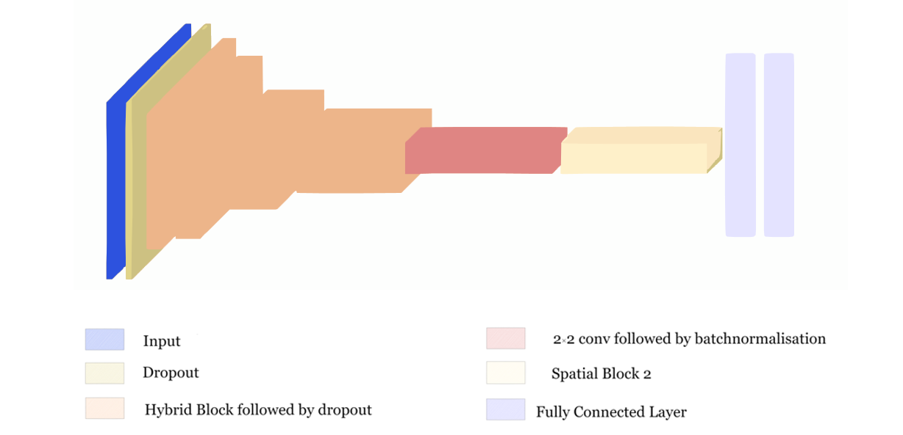

# SKIPNet-Spatial-Attention-Skip-Connections-for-Enhanced-Brain-Tumor-Classification
This project presents a robust deep learning framework for brain tumor classification using MRI images. By incorporating spatial attention as skip connections, the model achieves a remarkable accuracy of 96.90%.

# Key Features
High Accuracy: Achieved 96.9% classification accuracy.
Innovative Architecture: Utilized spatial attention mechanisms as skip connections to enhance feature extraction and information flow.
No data preprocessing was required by the model.

# Model Architecture
The model leverages convolutional neural network (CNN) with Spatial Attention added as Skip Connections for better feature extraction.
Dropouts were further utilised to apply regularization.

Below is a visualization of the model architecture used in this project:

# Training 
Optimizer: Adam optimizer with a learning rate of 0.001.
Loss Function: Sparse Categorical cross-entropy.
Validation: 10% data used for validation checks to prevent overfitting.

# Results
Accuracy: 96.90% on the test dataset.
Precision, Recall, F1-score: Detailed metrics available in results/metrics.txt.

# Pre-Print version of the paper can be accessed via:
http://arxiv.org/abs/2412.07736
